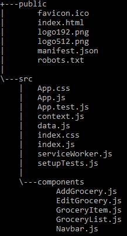

# Grocery Inventory Tracker

This is a Single Page Application (SPA) built using React and context api. In this tutorial you will be able to build a  Grocery Inventory Store that tracks expiration and quantity. We will be able to create, read, update and delete items created.

## Setup

We will use `npx create react app` , this helps us to quickly setup our developement environment . We will need to have Node version greater or equal to 8.10 and our npm should be greater than or equal to 5.6 installed on our machine.

### Installation 

I will be using vscode as my code editor, but we are free to use any code editor.
To start, we open the command line and cd to where we want to have our app installed, and run code below:

```javascript
npx create-react-app grocery-inventory-tracker
```

This creates a boiler plate we can start using for our app. To start the app, we run `npm start` and it opens a browser at `http://localhost:3000/` if no app is already using the port 3000.

For this project we will be using react state and  react context api. 
React Context Api helps us to create a global variable that can be passed around in our react App. Usually data is passed down from parent to child in a typical react app as _props_ . You can read more on [React Context API](https://reactjs.org/docs/context.html) .

## Folder Structure
We create __components__ subfolder in _src_ folder . In the _components_ folder we create the following files, _AddGrocery.js_, _EditGrocery.js_, _GroceryItem.js_, _GroceryList.js_, _Navbar.js_ .
We also create two other files in the root folder. These are _data.js_ that will host all our grocery objects and a _context.js_ .



## Dependencies

For this app we will require and install the following dependencies : (_react-router-dom_ _uuid_ _moment_ _react-datepicker_)

```
npm install --save react-router-dom uuid moment react-datepicker
```
* react-router-dom - This helps with client-side routing in a Single Page App that allows for navigation without page refreshing.
* uuid - They are 128-Bits unique numbers and we will use this to generate unique id's for our application.
* moment - We will use this to display data/time in friendly and easy way.
* react-datepicker - We will use this to display dates using calendar dialog.

## index.html

In our _index.html_ file we will have two cdn links for fontawesome icons and we use bootstrap for styling and rename the title tag as below. Notice that we have a div with _id_ root . This is where our app will be displayed.

```html
  <!DOCTYPE html>
<html lang="en">

<head>
  <meta charset="utf-8" />
  <link rel="icon" href="%PUBLIC_URL%/favicon.ico" />
  <meta name="viewport" content="width=device-width, initial-scale=1" />
  <meta name="theme-color" content="#000000" />
  <meta name="description" content="Web site created using create-react-app" />
  <!--font awesome-->
  <script src="https://cdnjs.cloudflare.com/ajax/libs/font-awesome/5.13.0/js/all.min.js"></script>

  <!-- bootstrap -->
  <link rel="stylesheet" href="https://stackpath.bootstrapcdn.com/bootstrap/4.4.1/css/bootstrap.min.css"
    integrity="sha384-Vkoo8x4CGsO3+Hhxv8T/Q5PaXtkKtu6ug5TOeNV6gBiFeWPGFN9MuhOf23Q9Ifjh" crossorigin="anonymous">

  <title>Grocery Inventory Tracking App</title>
</head>

<body>
  <noscript>You need to enable JavaScript to run this app.</noscript>
  <div id="root"></div>

</body>

</html>
  ```
## Data.js

We now create an array with objects called _groceriesDB_ and we export it because we will be using it in the context.js file.
The array contains objects that represent the Groceries we want to track.

```javascript
export const groceriesDB = [
    {
        image: 'https://images.unsplash.com/photo-1513791053024-3b50799fdd7b?ixlib=rb-1.2.1&q=80&fm=jpg&crop=entropy&cs=tinysrgb&w=1080&fit=max&ixid=eyJhcHBfaWQiOjF9',
        name: 'tomato',
        qty: 10,
        expiration: Date.now(),
        category: 'vegetable',
        id: 0.12654367
    },
    {
        image: 'https://images.unsplash.com/photo-1589927986089-35812388d1f4?ixlib=rb-1.2.1&q=80&fm=jpg&crop=entropy&cs=tinysrgb&w=1080&fit=max&ixid=eyJhcHBfaWQiOjF9',
        name: 'carrot',
        qty: 5,
        expiration: 'Thu Jul 20 2020 12:55:58 GMT+0100 (West Africa Standard Time)',
        category: 'vegetable',
        id: 0.12656547
    },
    {
        image: 'https://images.unsplash.com/photo-1589469224608-c84d02c71b94?ixlib=rb-1.2.1&q=80&fm=jpg&crop=entropy&cs=tinysrgb&w=1080&fit=max&ixid=eyJhcHBfaWQiOjF9',
        name: 'lettuce',
        qty: 20,
        expiration: 'Thu Jul 30 2020 12:55:58 GMT+0100 (West Africa Standard Time)',
        category: 'vegetable',
        id: 0.12656767
    },
    {
        image: 'https://images.unsplash.com/photo-1531191357516-0aa0289ab6c9?ixlib=rb-1.2.1&q=80&fm=jpg&crop=entropy&cs=tinysrgb&w=1080&fit=max&ixid=eyJhcHBfaWQiOjF9',
        name: 'maize',
        qty: 20,
        expiration: Date.now(),
        category: 'grain',
        id: 0.12650915
    },
]
```

## index.css
```css
body {
  margin: 0;
  font-family: -apple-system, BlinkMacSystemFont, 'Segoe UI', 'Roboto', 'Oxygen',
    'Ubuntu', 'Cantarell', 'Fira Sans', 'Droid Sans', 'Helvetica Neue',
    sans-serif;
  -webkit-font-smoothing: antialiased;
  -moz-osx-font-smoothing: grayscale;
}

#banner img{
  width:85%;
    height:300px;
    float: left;
    border-radius: 8px;
    object-fit: cover;
    margin-right: 20px;
    margin-left: 20px;
    margin-bottom: 20px;
    margin-top: 30px;
}


#tomato{
  width: 200px;
  height: 120px;
}
h5{
  /* color: #E83F6F; */
  color: #FFBF00;
}

a, a:hover, a:focus, a:active{
  text-decoration: none;
  color:inherit;
}
```

## Context.js
Next we move to the _context.js file_ and we create a class component and name it _GroceryProvider_ . At the top, we import createContext and _uuid_ and _data.js_ and then create a context object and name it _GroceryContext_. This object has two components: _Provider_ and _Consumer_ . _Provder_ provides all the data for our application, we will set it at the top of our application so that all other component of the application have access to it.
To use the data that the _Provider_ provides we use the _Consumer_ and we will be able to have access to the data from anywhere in our application.

We then create a _state_ object in the _GroceryProvider_ class with property _groceries_ and set the value to be _groceriesDB_ that we imported from _data.js_ , and set property _name_, _qty_, _category_, _id_, _image_ to an empty string. We set _expiration_ to a _new Date()_ value . We also create a property _updateEdit_ to an empty array. This will be used later in the app.

The _GroceryProvider_ then returns a _GroceyContext.Provider_ . Since the _GroceryContext.Provider_ will be at the top of our application we will also return the _children_ i.e `{this.props.children}` . The provider returns a value which is an object. In our own case `this.state` as seen below.

Lastly, we create a variable _GroceryConsumer_ which is equal to _GroceryContext.Consumer_ and we export both _GroceryProvider_ and _GroceryConsumer_ .

We also create an object _headerObj_, this will be use to dynamcally display text and image for header of our application. We will also create _addGrocery_, _removeGrocery_, _editGrocery_, _onSaveEdit_, _convertDate_ _changeValue_  functions. These will only log to the console for now and add the code later, we then  add them  in our _GroceryContext.Provider_. 

At this point when we try to _console.log_ the value of _this.state.groceries_ we get no output since the _Provider_ is not set at the top of our application. We do that next in the _index.js_ file.


```jsx
import React, { Component, createContext } from 'react';
import { groceriesDB } from './data';
import { v4 } from 'uuid';


const GroceryContext = createContext();
class GroceryProvider extends Component {
    state = {
        groceries: groceriesDB,
        id: '',
        name: '',
        qty: '',
        expiration: new Date(),
        category: '',
        image: '',
        updateEdit: [],
        searchCategory: ''
    }

   //dynamically displays values for the header of the application
      headerObj = {
        title: 'Groceries Inventory | Tracker',
        text: 'Total number of grocery items',
        img: 'https://images.unsplash.com/photo-1542838132-92c53300491e?ixlib=rb-1.2.1&q=80&fm=jpg&crop=entropy&cs=tinysrgb&w=1080&fit=max&ixid=eyJhcHBfaWQiOjF9'
    }

      convertDate = (str) => {
        lconsole.log('from convertDate')
    };

    addGrocery = (grocery) => {
        console.log('add grocery function')
    }


    removeGrocery = (id) => {
        console.log('remove grocery function')
    }

    editGrocery = (id) => {
        console.log('edit grocery function')
    }


    onSaveEdit = (id) => {

        console.log('on save edit function')
    }


render() {
        console.log(this.state.groceries)
        return (
            <GroceryContext.Provider value={{
                ...this.state,
                headerObj: this.headerObj,
                addGrocery: this.addGrocery,
                removeGrocery: this.removeGrocery,
                editGrocery: this.editGrocery,
                onSaveEdit: this.onSaveEdit
            }}>
                {this.props.children}
            </GroceryContext.Provider>
        )
    }
}

const GroceryConsumer = GroceryContext.Consumer;

export { GroceryProvider, GroceryConsumer } 


```

## index.js
Now in _index.js_ we import _React_ from `react`,  _BrowserRouter_ as _Router_ from `react-router-dom` , _GroceryProvider_ from `context.js` and _App_ from `App.js` .

So that the entire app has access to the _context api_ , we wrap the _Router_ and _App_ component inside the _GroceryProvider_.


```jsx
import React from 'react';
import ReactDOM from 'react-dom';
import { BrowserRouter as Router } from 'react-router-dom';
import { GroceryProvider } from './context';
import App from './App';
import * as serviceWorker from './serviceWorker';

ReactDOM.render(
  <GroceryProvider>
    <React.StrictMode>
      <Router>
        <App />
      </Router>
    </React.StrictMode>
  </GroceryProvider>
  ,
  document.getElementById('root')
);

```

Now we can test our _console.log_ in _context.js_ file and it should return the grocey data.


## App.js

Next, in our _App.js_ file we create a class base component and import _React_, _switch_, _route_, _Top_, _GroceryList_, _AddGrocery_, _EditGrocery_, as seen below. 

_react-router-dom_ , it comes with:

* Browser router - holds all info about our route
* Switch - for grouping our routes
* route - this will display specific routes
* Link - serves as an anchor tag

Inside _React.Fragment_ is followed by the _Top_ component which will be displayed at the top of our application . We are using _React.Fragment_ to mimic _HTML_ to serve as a parent _div_ and we export the _App.js_ component. We will then add 3 routes, for _Home_ (`/`) which will be the _GroceryList_, routes for adding new Groceries (`/add`) which is the _AddGrocery_ and edit route (`/edit/:id`) which is the _EditGrocery_ . We are have `:id` so as to edit specific Grocery.

 Next we create the _Top_ component.

```jsx
import React, { Component } from 'react';
import { Switch, Route } from 'react-router-dom'
import Navbar from './components/Navbar';
import GroceryList from './components/GroceryList';
import AddGrocery from './components/AddGrocery';
import EditGrocery from './components/EditGrocery';
import './App.css';


class App extends Component {

  render() {

    return (
      <React.Fragment>
        <Top />
        <Switch>
          <Route exact path="/" component={GroceryList} />
          <Route path="/add" component={AddGrocery} />
          <Route path="/edit/:id" component={EditGrocery} />
        </Switch>

      </React.Fragment>
    )
  }
}


export default App;

```

## Top.js 

Top.js is our header component. We import _React_, _GroceryConsumer_ so that we have access to all our data, _useLocation_, and _Link_ . _useLocation_ returns the current url, _Link_ is like an anchor tag such as _href_ and helps with navigation of our app.


```jsx
import React from 'react';
import { GroceryConsumer } from '../context';
import { useLocation, Link } from 'react-router-dom';


function Top() {
    let location = useLocation();
    //console.log(location.pathname)
    return (
        <div className="container">
            <div className="row">
                <div className="col-md-8 col-lg-8" id="banner">
                    <GroceryConsumer>
                        {(value) => {
                            return (
                                
                            )
                        }}

                    </GroceryConsumer>
                </div>
                <div className="col-md-4 col-lg-4">

                    <GroceryConsumer>
                        {(value) => {
                            return (

                                <div>
                                    <h1 className="mt-3">
                                        {value.headerObj.title}
                                    </h1>
                                    <h5><i>{value.headerObj.text} - {value.groceries.length}</i></h5>
                                    <button className="btn btn-lg btn-success mt-5">
                                        {location.pathname === '/' ? <Link to="/add">Add Grocery</Link> : <Link to="/">Home</Link>}
                                    </button>
                                </div>
                            )
                        }}

                    </GroceryConsumer>
                </div>
            </div>
        </div>
    )
}

export default Top
```

## GroceryList
First we import _react_,  _GroceryConsumer_, _GroceryItem_ . Then return a container div with tables. This will where our grocery items will be added.
Since we have access to the _groceries_ array from _GroceryConsumer_, we loop on the array using the map function which returns a _GroceryItem_ with _key_ and _grocery_ . These are passed as _props_ and will be used in the _GroceryItem_ component . We are also returning  a key because react requires all items to have unique identification.

At this point we will an error because our _GroceryItem_ component is not returning anything yet. Next we work on the _GroceryItem_.

```jsx
import React, { Component } from 'react';
import { GroceryConsumer } from '../context';
import GroceryItem from './GroceryItem'

export default class GroceryList extends Component {
    render() {
        return (
            <React.Fragment>
                <div className="container">
                    <div className="row">
                        <div className="col-md-12 col-lg-12">
                            <table className="table table-striped">
                                <thead>
                                    <tr>
                                        <th scope="col">Name</th>
                                        <th scope="col">Qty</th>
                                        <th scope="col">Exp</th>
                                        <th scope="col">Category</th>
                                        <th scope="col">Edit</th>
                                        <th scope="col">Delete</th>
                                    </tr>
                                </thead>
                                <tbody>
                                    <GroceryConsumer>
                                        {(value) => {
                                            console.log(value)
                                            return value.groceries.map(grocery => {
                                                return <GroceryItem key={grocery.id} grocery={grocery} />
                                            })
                                        }}
                                    </GroceryConsumer>
                                </tbody>
                            </table>
                        </div>
                    </div>
                </div>
            </React.Fragment>
        )


    }
}
```

## GroceryItem

In _GroceryItem_ compoent we import _React_, _GroceryConsumer_, _moment_ from moment (we installed this earlier), and _Link_ from _react-router-dom_ . 

Next, we create convertDate function that converts the date string for _expiration_ to timestamp and we use the _moment_ funtion to convert to friendly format e.g. 10 hours ago. After, the _render_ method we destructure _id_, _name_, _image_, _qty_, _expiration_, _category_ that was passed as _props_ from _GroceryList_ component. We are also using _GroceryConsumer_ here because will need access to two functions _editGrocery_ and _removeGrocery_. These two functions are not created yet, but we will create them later in _context.js_. 

Next, we then pass in the values of _name_, _image_, _qty_, _category_ . Now when we run _npm start_ our application should have all the items displayed on our frontpage. Next we work on the _AddGrocery_ component.


```jsx
import React, { Component } from 'react';
import { GroceryConsumer } from '../context';
import moment from 'moment';
import { Link } from 'react-router-dom';

export default class GroceryItem extends Component {

//convert date string
    convertDate = (str) => {
        let date = new Date(str),
            mnth = ("0" + (date.getMonth() + 1)).slice(-2),
            day = ("0" + date.getDate()).slice(-2);
        let covertedDate = [date.getFullYear(), mnth, day].join("-");
        return moment(covertedDate, 'YYYYMMDD').fromNow();
    };
    render() {
        const { id, name, image, qty, expiration, category } = this.props.grocery;
        console.log(this.props.grocery)

        return (
            <GroceryConsumer>
                {(value) => (
                    <tr>
                        <th scope="row"></th>
                        <td>{name}</td>
                        <td>{qty}</td>
                        {/* <td>{grocery.expiration}</td> */}
                        <td>{this.convertDate(expiration)}</td>
                        <td>{category}</td>
                        <td><Link to={"/edit/" + id}><span onClick={() => { value.editGrocery(id) }} ><i className="fas fa-pen"  ></i></span></Link></td>
                        <td ><span onClick={() => { value.removeGrocery(id) }} ><i

                            className="fas fa-trash"></i></span></td>
                    </tr>
                )}

            </GroceryConsumer>
        )
    }
}


```

## AddGrocery

In _AddGrocery_ component, we go ahead and import _React_, _GroceryConsumer_, _DatePicker_ (we installed this as a dependancy before).

We then create _AddGrocery_ class component and export it. Next we create a state object with _name_, _image_, _category_, _expiration_ and _qty_. After, this we create functions that will handle the state changes for each state properties.
After the render method we return _div_ container with the _AddGrocery_ form.

Notice we are using the _GroceryConsumer_ so that we have access to the _addGrocery_ method, also note the use of the _Datepicker_ for the date calendar. Next we look at the EditGrocery component.

```jsx
import React, { Component } from 'react';
import { GroceryConsumer } from '../context';
import DatePicker from "react-datepicker";
import "react-datepicker/dist/react-datepicker.css";


export default class AddGrocery extends Component {

    state = {
        name: '',
        image: '',
        category: '',
        expiration: new Date(),
        qty: ''
    }

    handleChangeName = (e) => {
        this.setState({
            name: e.target.value
        })
        console.log(this.state.name)
    }

    handleChangeImage = (e) => {
        this.setState({
            image: e.target.value
        })
    }

    handleChangeCategory = (e) => {
        this.setState({
            category: e.target.value
        })
    }

    handleChangeExpiration = (date) => {
        this.setState({
            expiration: date
        })
    }

    handleChangeQty = (e) => {
        this.setState({
            qty: e.target.value
        })
    }

    render() {
        return (
            <div className="container">
                <GroceryConsumer >
                    {(value) => {
                        //console.log(value)
                        //console.log(this.props)
                        this.handleSubmit = (e) => {
                            e.preventDefault();
                            value.addGrocery(this.state)
                            this.setState({
                                name: '',
                                image: '',
                                qty: '',
                                category: '',
                                expiration: new Date()
                            })
                            this.props.history.push('/')
                        }
                        // value.convertDate(1595886543865)
                        return <form onSubmit={this.handleSubmit}>
                            <div className="form-group">
                                <label htmlFor="Name" >Name</label>
                                <input type="text"
                                    className="form-control"
                                    onChange={this.handleChangeName}
                                    value={this.state.name}
                                    required
                                />
                            </div>
                            <div className="form-group">
                                <label htmlFor="Image" >Image</label>
                                <input type="text"
                                    className="form-control"
                                    onChange={this.handleChangeImage}
                                    value={this.state.image}
                                    required
                                />
                            </div>
                            <div className="form-group">
                                <div className="form-control">
                                    <label htmlFor="Quantity" >Quantity</label>
                                    <input type="number"
                                        onChange={this.handleChangeQty}
                                        value={this.state.qty}
                                        required
                                    />
                                </div>
                            </div>
                            <div className="form-group">
                                <div className="form-control">
                                    <label htmlFor="ExpirationDate">Expiration</label>

                                    <DatePicker selected={this.state.expiration} required onChange={this.handleChangeExpiration} />
                                </div>
                            </div>
                            <div className="form-group">
                                <label htmlFor="Category" >Category</label>
                                <input type="text"
                                    className="form-control"
                                    onChange={this.handleChangeCategory}
                                    value={this.state.category}
                                    required
                                />
                            </div>
                            <div className="form-group center">
                                <button type="submit" className="btn btn-primary">Add</button>
                            </div>
                        </form>
                    }}
                </GroceryConsumer>
            </div>
        )
    }
}


```
## EditGrocey

We import _React_, _Link_, _GroceryConsumer_, _DatePicker_ and create a class component called _EditGrocery_ . After the _render_ method we return a _form_ element and the _GroceryConsumer_ that gives us access to some methods defined in _context.js_ and we export the class component.
Next, we will go back to _context.js_ where we complete the functions we created.

```jsx
import React, { Component } from 'react';
import { Link } from 'react-router-dom';
import { GroceryConsumer } from '../context';
import DatePicker from "react-datepicker";
import "react-datepicker/dist/react-datepicker.css";


export default class EditGrocery extends Component {

    render() {

        return (

            <div className="container">
                <GroceryConsumer >
                    {(value) => {
                        return <form >
                            <div className="form-group">
                                <label htmlFor="Name" >Name</label>
                                <input type="text"
                                    className="form-control"
                                    onChange={(e) => { value.changeValue(e, 'name') }}
                                    value={value.name}
                                    required
                                />

                            </div>
                            <div className="form-group">
                                <label htmlFor="Image" >Image</label>
                                <input type="text"
                                    className="form-control"
                                    onChange={(e) => { value.changeValue(e, 'image') }}
                                    value={value.image}
                                    required
                                />

                            </div>
                            <div className="form-group">
                                <div className="form-control">
                                    <label htmlFor="Quantity" >Quantity</label>
                                    <input type="text"
                                        onChange={(e) => { value.changeValue(e, 'qty') }}
                                        value={value.qty}
                                        required
                                    />
                                </div>
                            </div>


                            <div className="form-group">
                                <div className="form-control">
                                    <label htmlFor="ExpirationDate">Expiration</label>
                                    <DatePicker selected={value.convertDate(value.expiration).selected}

                                        required
                                    />
                                </div>
                            </div>

                            <div className="form-group">
                                <label htmlFor="ChemicalName" >Category</label>
                                <input type="text"
                                    className="form-control"
                                    onChange={(e) => { value.changeValue(e, 'category') }}
                                    value={value.category}
                                    required
                                />

                            </div>

                            <div className="form-group center">
                                <button onClick={() => { value.onSaveEdit(value.id) }} type="submit" className="btn btn-primary"><Link to="/">Save</Link></button>
                            </div>
                        </form>
                    }}

                </GroceryConsumer>
            </div>
        )

    }
}

```

## Context.js continued

### addGrcery
The _addGrocery_ method adds new Grocery item to the inventory. The _uuid_ we imported earlier helps in generating unique id. 
We create a variable _groceries_ , using the spread operator we add the exiting grocery items in the array and add the new _grocery_ item. We then use _setState_ to update the new object state with the new added grocery item. 

```jsx
addGrocery = (grocery) => {
        //let tempGroceries = [...this.state.groceries];
        grocery.id = v4();
        let groceries = [...this.state.groceries, grocery]
        this.setState(() => {
            return { groceries: groceries }
        })
    }
```
### getGrocery
The getGrocery method returns a _grocery item_ that is clicked . It does this by comparing the grocery item id that equals to the grocery id that is clicked using the find method.

```jsx
//returns grocery with id that is clicked
    getGrocery = (id) => {
        const grocery = this.state.groceries.find(grocery => grocery.id === id)
        return grocery;
    }

```

### removeGrocery
The _removeGrocery_ method, removes _grocery item_ that is clicked.
First we create a temporary array with all groceries. Then using the filter method on the temp array, it removes grocery id that is clicked.


```jsx
  removeGrocery = (id) => {
        let tempGroceries = [...this.state.groceries];
        tempGroceries = tempGroceries.filter(grocery => grocery.id !== id);
        //const index = groceriesDB.indexOf(this.getGrocery(id))
        this.setState(() => {
            return {
                groceries: [...tempGroceries]
            }
        })
    }

```

### changeValue
This method checks the input value if equals to the string e.g. _name_ and updates the the state properties.
We created the variable _tempArr_ to get the properties and values of the grocery item to be edited as this will be used later in the _saveEdit_ function.
```jsx
    changeValue = (e, value1) => {
        if (value1 === 'name') {
            this.state.name = e.target.value;
        }
        if (value1 === 'image') {
            this.state.image = e.target.value;
        }
        if (value1 === 'expiration') {
            this.state.expiration = e.target.value;
        }
        if (value1 === 'category') {
            this.state.category = e.target.value;
        }
        if (value1 === 'qty') {
            this.state.qty = e.target.value;
        }
        if (value1 === 'searchCategory') {
            this.state.searchCategory = e.target.value;
        }

        const tempArr = [
            this.state.id,
            this.state.name,
            this.state.image,
            this.state.expiration,
            this.state.qty,
            this.state.category
        ]
        console.log(tempArr)
        this.setState({
            updateEdit: tempArr
        })
        console.log(this.state)
    }
```

### editGrocery
This function is called when the edit icon is clicked in the _GroceryItem_ component. First we  pass in an _id_ as a parameter and create a temporary groceries array, then we get the index of the grocery item clicked and store the index number in the index variable;  and we now assigned the clicked grocery item object to _selectedGrocery_. Using _setState_, we update each of the state properties e.g. id, name.

```jsx
editGrocery = (id) => {
        let tempGroceries = this.state.groceries;
        const index = tempGroceries.indexOf(this.getGrocery(id));
        const selectedGrocery = tempGroceries[index];
        this.setState({
            id: selectedGrocery['id'],
            name: selectedGrocery['name'],
            qty: selectedGrocery['qty'],
            expiration: selectedGrocery['expiration'],
            image: selectedGrocery['image'],
            category: selectedGrocery['category']
        })
    }

```

### onEditSave
This function saves the selected grocery item that is changed.
If _id_ is true, 
* we create a groceries array as and assign it to a vairable _groceriesArr_.
* Get the index of a selected grocery item and assign it to variable _index_
* Create a variable _record_, which is the selected grocery item.
* Update property name of selected grocery item.
* Update state with setState and reset the input values to be empty.
```jsx
 onSaveEdit = (id) => {

        if (id !== null) {
            const groceriesArr = this.state.groceries; 
            const index = groceriesArr.indexOf(this.getGrocery(id));
            const record = groceriesArr[index];
            //update selected property name
            record['name'] = this.state.updateEdit[1];
            record['image'] = this.state.updateEdit[2];
            record['expiration'] = this.state.updateEdit[3];
            record['qty'] = this.state.updateEdit[4];
            record['category'] = this.state.updateEdit[5];
            this.setState({
                groceries: [...this.state.groceries],
                id: '', name: '', image: '', expiration: '', qty: '', category: ''
            })

            console.log(this.state)
            console.log(this.state.updateEdit)

        }
    }
```

Running our application, we can now add a new grocery item, edit, and delete grocery item.

## Conclusion

Congratulation, we have succesfully created a Grocery Inventory Tracker, that tracks expiration and quantity.